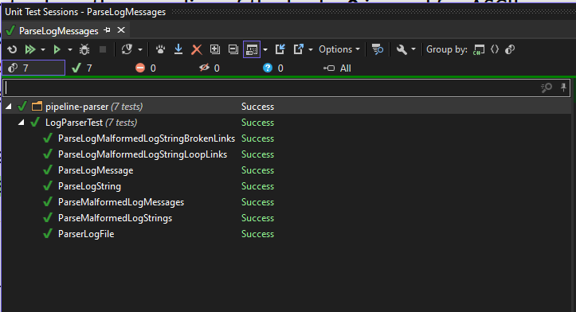

## There are three files in this project:
1. main.cpp : This is the main file that contains the running/testing of the program.
2. logparser.h: This file contains the class definition for LogParser.
3. logparser.cpp: This file contains the implementation of the LogParser class.

## There are also log files in the logs directory.

## Algorithm
The program reads the log files and parse the messages.   

It puts the parsed messages into an unordered_map of messages and inserts the message id to a **"previous message id"** unordered_map. 

This helps to find a message which is not in the previous message id map that is the first message. 

After that it creates a vector and inserts the messages following the next_ids starting form the first message. It fills the vector from end to begin (reverse order).  

Finally, it prints the messages in the vector:

or the printable string can be received and used.

## Unit tests

The unit tests are implemented using Google Test framework. 
They check for malformed lines, correct parsing of messages, and the correct order of messages:

